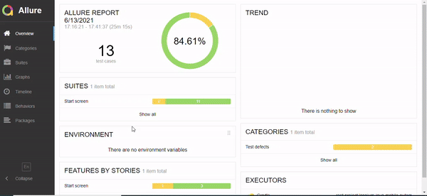
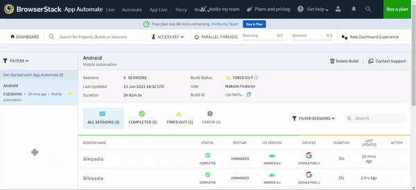
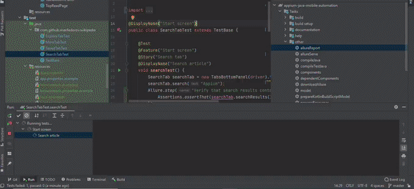

## Mobile Automation with Appium for Wikipedia app 

### Technology Stack

- Java
- Appium
- Gradle
- Junit5
- Allure Report
- Browserstack
- Selenoid

### Run tests
Copy-paste and fill configs from `resources/*.properties.examples` files to `*.properties` files

Run on local device: `gradlew testLocal` or `gradlew test -Ddriver=local`

Run on selenoid: `gradlew testSelenoid` or `gradlew test -Ddriver=selenoid` 

Run on browserstack: `gradlew testBrowserstack` or `gradlew test -Ddriver=browserstack` 

### Allure report

### Browserstack

### Selenoid

